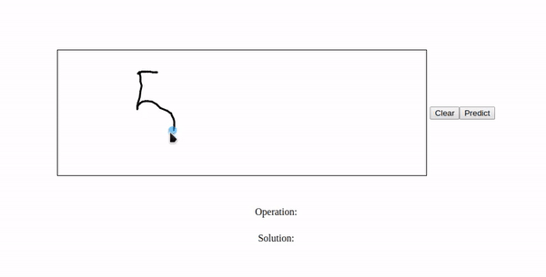

# HandMath

HandMath is an intelligent web-based calculator that recognizes handwritten mathematical operations using deep learning. Draw your operation (e.g., `12+7`, `5x3`, `9-2`) in the browser, and HandMath will predict the operation and compute the solution.



## Features

- **Handwritten Math Recognition:** Draw numbers and operators (+, -, x) directly in your browser.
- **Deep Learning Model:** Uses a Convolutional Neural Network (CNN) for digit and operator recognition.
- **Instant Calculation:** Automatically solves the recognized operation.
- **Modern UI:** Responsive, beautiful interface with a custom background.


## Requirements

- Python 3.7+
- pip

### Python Dependencies

All required Python packages are listed in `requirements.txt`. Major dependencies include:
- Flask
- TensorFlow
- Keras
- OpenCV
- NumPy
- Pandas
- Pillow

Install them with:

```bash
pip install -r requirements.txt
```

## Project Structure

```
HandMath/
│
├── app.py                  # Main Flask application
├── cnn.py                  # CNN model and prediction logic
├── requirements.txt        # Python dependencies
├── model/
│   ├── model.json          # Model architecture (Keras)
│   └── model_weights.h5    # Model weights (Keras)
├── static/
│   └── Background.jpeg     # UI background image
├── templates/
│   └── index.html          # Main HTML template
└── README.md               # Project documentation
```

## Setup & Usage

1. **Clone the repository:**
   ```bash
   git clone https://github.com/sachit62/HandMath.git
   cd HandMath
   ```

2. **Install dependencies:**
   ```bash
   pip install -r requirements.txt
   ```

3. **Ensure model files are present:**
   - `model/model.json`
   - `model/model_weights.h5`
   (These are required for prediction. If missing, contact the author or retrain the model.)

4. **Run the application:**
   ```bash
   python app.py
   ```

5. **Open your browser and go to:**
   ```
   http://127.0.0.1:5000
   ```

## How to Use

1. Draw a mathematical operation (e.g., `12+7`, `5x3`, `9-2`) in the canvas area.
2. Click **Predict**.
3. The recognized operation and its solution will appear below.
4. Click **Clear** to reset the canvas.

## Model Details

- The CNN model is defined in `cnn.py` and loaded from `model/model.json` and `model/model_weights.h5`.
- Supports digits (0-9) and operators (+, -, x).
- You can retrain or update the model using your own dataset (see `cnn.py` for details).

## License

This project is licensed under the MIT License.
